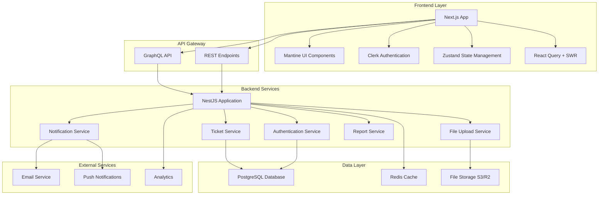
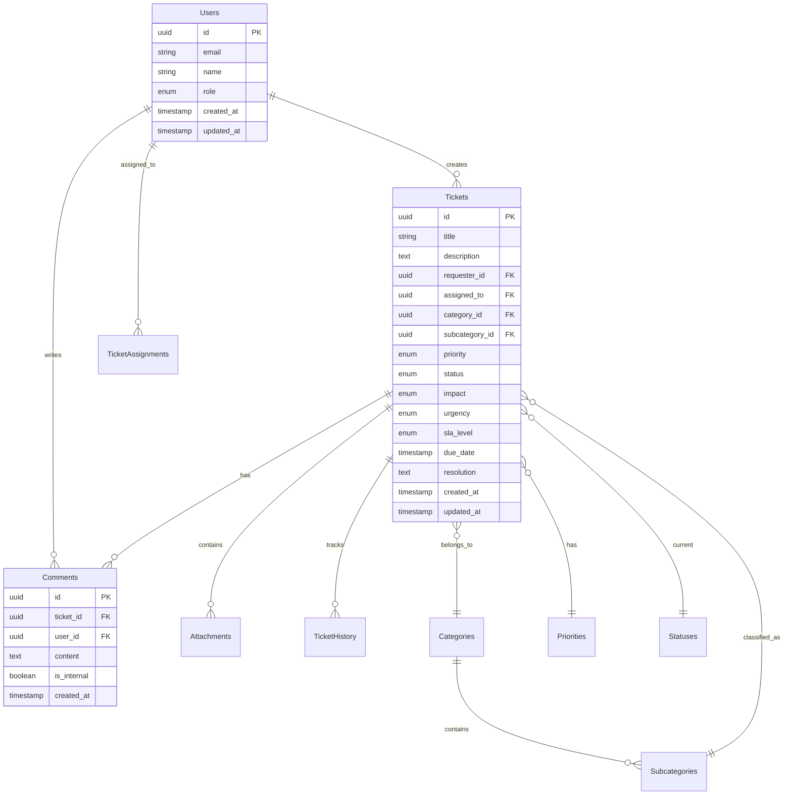

# NTG-Ticket System

## Executive Summary

The system is designed as a centralized platform for managing IT support requests, tracking ticket progress, facilitating communication between users and support staff, and providing reporting capabilities.

**Document Details:**
- **System Name:** NTG-Ticket (IT Ticket Management System)
- **Version:** 1.0
- **Created:** January 20, 2025
- **Author:** Zeeshan Hasnain

---

## Feature Set Requirement

### 1. User Management & Authentication

| Feature | Description | Status | Requirements |
|---------|-------------|--------|--------------|
| **User Roles** | Four distinct user roles with specific permissions | ✅ Defined | End Users, IT Support Staff, IT Support Managers, System Administrators |
| **Authentication Methods** | Email  | ✅ Defined | AR1: Email |
| **Sign-up Process** | New user registration with prompts | ✅ Defined | AR2: Default prompt for new users |
| **Custom Login UI** | Branded login interface with grouped fields | ✅ Defined | AR3-AR4: Custom look and feel |
| **Role-Based Permissions** | Granular permissions per user role | ✅ Defined | View, create, update, assign, escalate, report |

### 2. Ticket Lifecycle Management

| Feature | Description | Status | Requirements |
|---------|-------------|--------|--------------|
| **Ticket Statuses** | Seven defined ticket states | ✅ Defined | New, Open, In Progress, On Hold, Resolved, Closed, Reopened |
| **Status Transitions** | Defined workflow between statuses | ✅ Defined | Submission → Review → Assignment → Resolution → Closure |
| **Auto-Status Updates** | System-managed status changes | ✅ Defined | Auto-close after inactivity, auto-population |
| **Reopening Capability** | Ability to reopen closed tickets | ✅ Defined | When issues persist after resolution |

### 3. Ticket Fields & Data Management

| Field Name | Data Type | Required | Auto-Generated | Usage |
|------------|-----------|----------|----------------|-------|
| **Ticket ID** | Alphanumeric | Yes | Yes | Unique identifier, tracking, auditing |
| **Title** | Text (Max chars) | Yes | No | Brief issue summary |
| **Description** | Text Block | Yes | No | Detailed issue explanation |
| **Category** | Enum | Yes | No | Hardware, Software, Network, Access, Other |
| **Subcategory** | Enum (Dependent) | Yes | No | Specific classification within category |
| **Priority** | Enum | Yes | Defaulted | Low, Medium, High, Critical |
| **Status** | Enum | Yes | Yes | Current lifecycle state |
| **Assigned To** | User ID | No | No | Responsible support staff |
| **Requester** | User ID | Yes | Yes | Ticket submitter |
| **Creation Date** | DateTime | Yes | Yes | Submission timestamp |
| **Last Updated** | DateTime | Yes | Yes | Most recent activity |
| **Due Date** | DateTime | No | Calculated | Based on SLA and priority |
| **Attachments** | File Upload | No | No | Supporting documents/screenshots |
| **Comments** | Text Blocks | No | No | Communication thread |
| **Resolution** | Text Block | Yes* | No | Solution details (*required before closing) |
| **SLA Level** | Enum | Yes | Defaulted | Standard, Premium, Critical Support |
| **Related Tickets** | Ticket ID List | No | No | Dependencies/duplicates |
| **Impact** | Enum | Yes | Defaulted | Minor, Moderate, Major, Critical |
| **Urgency** | Enum | Yes | Defaulted | Low, Normal, High, Immediate |
| **Custom Fields** | Various | Configurable | No | Organization-specific data |

### 4. Workflow Management

| Workflow Phase | Features | Requirements |
|----------------|----------|--------------|
| **Submission** | Form validation, auto-population, file uploads | FR1-FR6 |
| **Review & Assignment** | Triage, categorization, assignment, SLA calculation | Field updates, notifications |
| **Processing** | Status updates, communication, progress tracking | FR7-FR10 |
| **Resolution** | Solution documentation, status change to resolved | Resolution field completion |
| **Closure** | User confirmation, auto-closure, final documentation | Notification, timeout handling |

### 5. Communication & Notifications

| Feature | Description | Requirements |
|---------|-------------|--------------|
| **Status Change Notifications** | Alerts for key field updates | FR11: Status, Assigned To, Due Date |
| **Due Date Reminders** | Proactive alerts before deadline | FR12: Pre-due date notifications |
| **Comment Notifications** | Alerts for new communications | FR13: Comment thread updates |
| **Direct Response** | Reply through system interface | FR14: In-system communication |

### 6. Reporting & Analytics

| Feature | Description | Requirements |
|---------|-------------|--------------|
| **Field-Based Reports** | Reports on all ticket fields | FR15: Category, Priority, Status, etc. |
| **Analytical Insights** | Trend analysis and performance metrics | FR16: Common issues, response times |
| **Filtering & Sorting** | Advanced ticket search capabilities | FR17: Multi-field filtering |

### 7. System Administration

| Feature | Description | Requirements |
|---------|-------------|--------------|
| **Field Configuration** | Admin control over field options | FR18: Category, Priority, Impact, etc. |
| **Custom Fields** | Organization-specific field creation | FR19: Additional data capture |
| **Permission Management** | Role-based field access control | FR20: Visibility and edit permissions |
| **Data Integrity** | Validation rules enforcement | FR21: Data validation and integrity |

### 8. Non-Functional Requirements

| Category | Features | Requirements |
|----------|----------|--------------|
| **Usability** | Web-based interface, multi-language support, help system | NFR1-NFR3 |
| **Performance** | Concurrent access, 2-second response time | NFR4-NFR5 |
| **Security** | Authentication, encryption, access control | NFR6-NFR8 |
| **Scalability** | Growth accommodation, integration support | NFR9-NFR10 |
| **Compliance** | Data protection, audit logging | NFR11-NFR12 |

### 9. User Interface Requirements

| Feature | Description | Requirements |
|---------|-------------|--------------|
| **Dashboard** | User ticket overview | UIR1: Open and resolved tickets |
| **Dynamic Forms** | Category-based field updates | UIR2: Dynamic field behavior |
| **Search Functionality** | Multi-criteria ticket search | UIR3: Various search criteria |
| **Responsive Design** | Multi-device compatibility | UIR4: Desktop, tablet, mobile |
| **Support Interface** | Staff ticket management | UIR5: Efficient ticket handling |
| **Form Validation** | Real-time input validation | UIR7: Immediate error feedback |
| **Structured Display** | Organized ticket detail view | UIR9: Readable format |

### 10. SLA Management

| SLA Level | Response Time | Resolution Time | Usage |
|-----------|---------------|-----------------|-------|
| **Standard** | 8 business hours | 5 business days | General inquiries, non-urgent |
| **Premium** | 4 business hours | 2 business days | Higher urgency/impact |
| **Critical Support** | Immediate (24/7) | 4 business hours | Critical system failures |

---

### 11. Complete Technology Stack Specification

#### 11.1 Frontend Technology Stack

| Component | Technology | Justification | Implementation Notes |
|-----------|------------|---------------|---------------------|
| **Framework** | Next.js 14+ with App Router | Modern React framework with SSR/SSG capabilities, excellent performance | TypeScript support, file-based routing |
| **UI Library** | Mantine 7.x | Comprehensive React components library with built-in theming | Dark/light mode support, form validation, notifications |
| **Authentication** | Clerk | Modern authentication service with social logins | JWT tokens, role-based access, user management |
| **State Management** | Zustand | Lightweight, TypeScript-friendly state management | Simple API, no boilerplate, excellent DevTools |
| **Data Fetching** | React Query (TanStack Query) + SWR | Powerful data synchronization and caching | React Query for mutations, SWR for real-time data |
| **Forms** | Mantine Form | Performance-focused form handling | Schema validation with Zod/Yup |
| **Styling** | Mantine CSS-in-JS | Utility-first CSS with component styling | Responsive design, custom themes |
| **Icons** | Tabler Icons (Mantine compatible) | Consistent icon system | SVG-based, tree-shakeable |
| **Charts/Analytics** |  Mantine Charts | Data visualization for reports | Interactive charts, responsive |
| **File Upload** | Mantine Dropzone  | Robust file handling | Multiple file types, progress tracking |
| **Notifications** | Mantine Notifications | Toast notifications system | Success, error, info notifications |
| **Date/Time** | Mantine DatePicker | Lightweight date manipulation | Timezone support, localization |
| **Rich Text** | Mantine RichTextEditor (Quill-based) | WYSIWYG editor for ticket descriptions | Markdown support, file attachments |

#### 11.2 Backend Technology Stack

| Component | Technology | Justification | Implementation Notes |
|-----------|------------|---------------|---------------------|
| **Framework** | NestJS | Enterprise-grade Node.js framework | Modular architecture, dependency injection |
| **API Layer** | GraphQL with Apollo Server | Flexible query language, single endpoint | Schema-first approach, real-time subscriptions |
| **Database** | PostgreSQL 15+ | ACID compliance, complex queries, JSON support | Full-text search, audit logging |
| **ORM** | Prisma | Type-safe database client | Auto-generated types, migrations, seeding |
| **Authentication** | Clerk Backend SDK + JWT Guards | Seamless integration with frontend auth | Role-based permissions, session management |
| **File Storage** | CloudFlare R2 | Scalable object storage | CDN integration, signed URLs |
| **Email Service** |  AWS SES | Reliable email delivery | Template management, tracking |
| **Caching** | Redis | In-memory caching and sessions | Real-time features, rate limiting |
| **Search** | PostgreSQL Full-Text Search + Elasticsearch  | Advanced search capabilities | Faceted search, autocomplete |
| **Background Jobs** | Bull Queue + Redis | Reliable job processing | Email notifications, report generation |
| **Validation** | Class Validator + Class Transformer | Request/response validation | DTO validation, sanitization |
| **Logging** | Winston + Morgan | Structured logging | Error tracking, audit trails |

#### 11.3 Real-time & Communication

| Component | Technology | Justification | Implementation Notes |
|-----------|------------|---------------|---------------------|
| **WebSockets** | GraphQL Subscriptions + Socket.io | Real-time updates | Ticket status changes, live notifications |
| **Push Notifications** | Web Push API + Service Workers | Browser notifications | Offline support, engagement |

#### 11.4 Development & DevOps

| Component | Technology | Justification | Implementation Notes |
|-----------|------------|---------------|---------------------|
| **Language** | TypeScript | Type safety, better DX | Strict mode, path mapping |
| **Package Manager** | pnpm | Fast, disk-efficient | Monorepo support, security |
| **Build Tools** | Vite (for dev tools) + Next.js built-in | Fast development builds | Hot reload, optimizations |
| **Code Quality** | ESLint + Prettier + Husky | Code consistency | Pre-commit hooks, automated formatting |
| **Testing** | Jest + React Testing Library + Playwright | Comprehensive testing | Unit, integration, E2E tests |
| **API Documentation** | GraphQL Playground + Swagger (REST endpoints) | Interactive API docs | Schema introspection, testing |
| **Containerization** | Docker + Docker Compose | Consistent environments | Multi-stage builds, development setup |
| **CI/CD** | GitHub Actions / GitLab CI | Automated deployments | Testing, building, deployment pipelines |
| **Monitoring** | Sentry + Grafana + Prometheus | Error tracking, performance monitoring | Real-time alerts, metrics dashboard |

#### 11.5 Documentation System

| Component | Technology | Justification | Implementation Notes |
|-----------|------------|---------------|---------------------|
| **User Documentation** | Markdown + Gitbook  | Easy to maintain, version control | Searchable, responsive, multilingual |
| **Developer Documentation** | Markdown + Gitbook | Auto-generated from code comments | API references, architecture diagrams |
| **Diagrams** | Mermaid.js | Code-based diagrams | Flowcharts, sequence diagrams, ER diagrams |
| **API Schema** | GraphQL Schema Documentation | Auto-generated from schema | Interactive queries, type definitions |
| **Architecture Diagrams** | Mermaid | Visual system architecture | Database schema, flow diagrams |

#### 11.6 Reusable Code Architecture

| Component | Approach | Implementation | Benefits |
|-----------|----------|----------------|----------|
| **Component Library** |  Custom Components | Shared UI components built on Mantine | Consistency, reusability, documentation |
| **Utility Functions** | Custom hooks + Utility libraries | Shared business logic, data transformations | DRY principle, maintainability |
| **GraphQL Fragments** | Shared fragments + Code generation | Reusable query/mutation pieces | Type safety, consistency |
| **Validation Schemas** | Zod schemas + Shared validators | Common validation logic | Frontend/backend consistency |
| **Configuration** | Environment-based configs | Shared constants, API endpoints | Easy deployment, maintenance |

#### 11.7 Additional Recommended Technologies

| Category | Technology | Purpose | Priority |
|----------|------------|---------|----------|
| **Analytics** | Mixpanel / PostHog | User behavior tracking | Medium |
| **Error Boundary** | React Error Boundary | Graceful error handling | High |
| **Internationalization** | react-i18next | Multi-language support | Medium |
| **PDF Generation** | Puppeteer / jsPDF | Report generation | High |
| **Excel Export** | SheetJS | Data export functionality | Medium |
| **Image Optimization** | Next.js Image + Sharp | Optimized image delivery | High |
| **Security Headers** | Helmet.js | Security best practices | High |
| **Rate Limiting** | express-rate-limit + Redis | API protection | High |
| **Data Backup** | pg_dump + S3 | Database backups | High |
| **Load Balancing** | Nginx / AWS ALB | High availability | Medium |

---

### 12. Implementation Architecture Overview

#### 12.1 System Architecture Diagram (Mermaid)



#### 12.2 Database Schema Overview (Mermaid)



#### 12.3 Deployment Architecture

| Environment | Configuration | Scaling Strategy |
|-------------|---------------|------------------|
| **Development** | Docker Compose, Local DB | Single instance |
| **Staging** | Kubernetes, Cloud DB | 2 replicas |
| **Production** | Kubernetes, Managed services | Auto-scaling 3-10 replicas |

#### 12.4 Security Implementation

| Layer | Security Measures | Implementation |
|-------|------------------|----------------|
| **Frontend** | CSP headers, HTTPS, Input validation | Next.js security headers, Zod validation |
| **API** | JWT validation, Rate limiting, CORS | NestJS guards, express-rate-limit |
| **Database** | Row-level security, Encryption at rest | PostgreSQL RLS, AWS RDS encryption |
| **Infrastructure** | VPC, Security groups, WAF | AWS/GCP security best practices |

---

### 13. Development Workflow & Best Practices

#### 13.1 Code Organization Structure

```
ntg-ticket/
├── apps/
│   ├── frontend/              # Next.js application
│   │   ├── src/
│   │   │   ├── components/    # Reusable UI components
│   │   │   ├── pages/         # Next.js pages
│   │   │   ├── hooks/         # Custom React hooks
│   │   │   ├── stores/        # Zustand stores
│   │   │   ├── utils/         # Utility functions
│   │   │   └── types/         # TypeScript type definitions
│   │   └── public/            # Static assets
│   ├── backend/               # NestJS application
│   │   ├── src/
│   │   │   ├── modules/       # Feature modules
│   │   │   ├── common/        # Shared utilities
│   │   │   ├── guards/        # Authentication guards
│   │   │   └── schemas/       # GraphQL schemas
│   │   └── prisma/            # Database schema and migrations
│   └── docs/                  # Documentation site
├── packages/
│   ├── ui/                    # Shared UI component library
│   ├── types/                 # Shared TypeScript types
│   └── utils/                 # Shared utility functions
├── tools/
│   ├── scripts/               # Build and deployment scripts
│   └── configs/               # Shared configurations
└── docker/                   # Docker configurations
```

#### 13.2 Development Standards

| Category | Standard | Tool/Implementation |
|----------|----------|-------------------|
| **Code Style** | Consistent formatting | Prettier + ESLint |
| **Type Safety** | Strict TypeScript | tsconfig strict mode |
| **Testing** | 80%+ coverage | Jest + React Testing Library |
| **Documentation** | All public APIs documented | JSDoc + TypeDoc |
| **Git Workflow** | Feature branch + PR | GitHub Flow |
| **Code Review** | Required for all changes | GitHub PR reviews |

#### 13.3 Performance Optimization

| Area | Strategy | Implementation |
|------|----------|----------------|
| **Frontend** | Code splitting, lazy loading | Next.js dynamic imports |
| **API** | Query optimization, caching | GraphQL query analysis, Redis |
| **Database** | Indexing, query optimization | PostgreSQL indexes, query analysis |
| **Assets** | CDN, image optimization | CloudFlare/AWS CloudFront |

---

### 14. Documentation Strategy

#### 14.1 User Documentation Structure

```
User Documentation/
├── Getting Started/
│   ├── Account Setup
│   ├── First Ticket
│   └── Navigation Guide
├── Features/
│   ├── Ticket Management
│   ├── Communication
│   └── Reporting
├── Troubleshooting/
│   ├── Common Issues
│   └── FAQ
└── Video Tutorials/
    ├── Basic Usage
    └── Advanced Features
```

#### 14.2 Developer Documentation Structure

```
Developer Documentation/
├── Architecture/
│   ├── System Overview
│   ├── Database Design
│   └── API Design
├── Setup & Development/
│   ├── Local Environment
│   ├── Testing Guide
│   └── Deployment Guide
├── API Reference/
│   ├── GraphQL Schema
│   ├── REST Endpoints
│   └── Authentication
└── Contributing/
    ├── Code Standards
    ├── Git Workflow
    └── Release Process
```

#### 14.3 Documentation Tools & Automation

| Type | Tool | Features |
|------|------|----------|
| **User Docs** | Gitbook | Versioning, search, i18n |
| **API Docs** | GraphQL Playground | Interactive queries, schema explorer |
| **Code Docs** | Gitbook | Auto-generated from comments |
| **Diagrams** | Mermaid.js | Version-controlled diagrams |
| **Screenshots** | Automated capture | CI/CD integration |

---