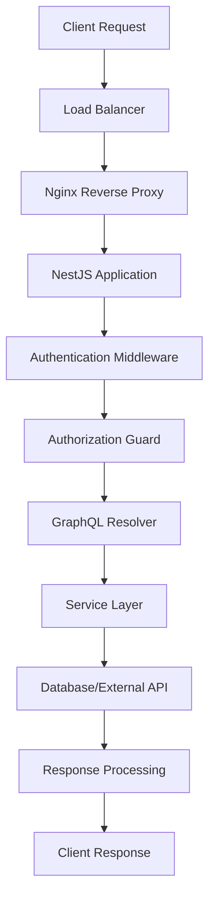
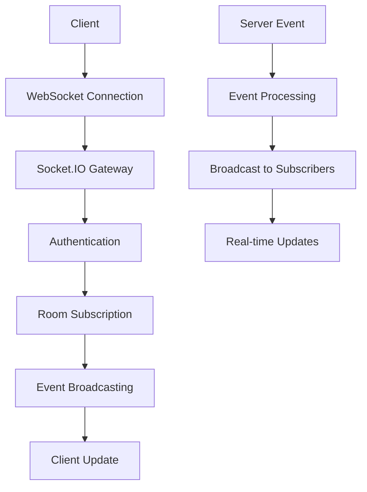

# System Overview

This document provides a comprehensive overview of the NTG Ticket system architecture, including technology choices, system design principles, and high-level component interactions.

## 🎯 System Purpose

The NTG Ticket system is a comprehensive IT service management (ITSM) platform designed to streamline support operations, improve service quality, and provide detailed analytics for IT support teams.

### Core Objectives
- **Efficiency**: Streamline ticket management workflows
- **Transparency**: Provide real-time visibility into support operations
- **Scalability**: Support growing organizations and ticket volumes
- **Integration**: Connect with existing IT infrastructure
- **Compliance**: Maintain audit trails and regulatory compliance

## 🏗️ Architecture Overview

### System Type
The NTG Ticket system follows a **Modular Monolith** architecture pattern, providing the benefits of microservices (modularity, maintainability) while avoiding the complexity of distributed systems.

### Key Architectural Decisions

**1. Modular Monolith**
- **Rationale**: Simplified deployment, easier development, better performance
- **Benefits**: Single deployment unit, shared database, simplified debugging
- **Trade-offs**: Less isolation between modules, potential for tight coupling

**2. GraphQL API**
- **Rationale**: Flexible data fetching, type safety, real-time subscriptions
- **Benefits**: Client-specific queries, reduced over-fetching, strong typing
- **Trade-offs**: Learning curve, potential performance issues with complex queries

**3. PostgreSQL Database**
- **Rationale**: ACID compliance, strong consistency, rich feature set
- **Benefits**: Reliable transactions, JSON support, excellent performance
- **Trade-offs**: Vertical scaling limitations, complexity for simple queries

## 🏛️ System Components

### Frontend Layer

**Next.js Application**
- **Framework**: Next.js 14 with App Router
- **Language**: TypeScript for type safety
- **UI Library**: Mantine for consistent design system
- **State Management**: Zustand for global state
- **Data Fetching**: TanStack Query for server state management

**Key Features**:
- Server-side rendering (SSR) for SEO and performance
- Static site generation (SSG) for static content
- Progressive Web App (PWA) capabilities
- Real-time updates via WebSocket connections
- Internationalization support with next-intl

### Backend Layer

**NestJS Application**
- **Framework**: NestJS with TypeScript
- **Architecture**: Modular architecture with dependency injection
- **API**: GraphQL with Apollo Server
- **Authentication**: JWT with Passport strategies
- **Validation**: Class-validator for input validation

**Core Modules**:
- **AuthModule**: User authentication and authorization
- **TicketsModule**: Core ticket management functionality
- **UsersModule**: User management and profiles
- **NotificationsModule**: Email and in-app notifications
- **ReportsModule**: Analytics and reporting
- **AdminModule**: System administration features

### Data Layer

**Primary Database - PostgreSQL**
- **Version**: PostgreSQL 15
- **ORM**: Prisma for type-safe database access
- **Features**: ACID transactions, JSON columns, full-text search
- **Optimization**: Connection pooling, query optimization, indexing

**Caching Layer - Redis**
- **Purpose**: Session storage, caching, message queuing
- **Features**: In-memory storage, pub/sub messaging, data structures
- **Usage**: API response caching, session management, background job queues

**Search Engine - Elasticsearch**
- **Purpose**: Full-text search, analytics, log aggregation
- **Features**: Distributed search, real-time indexing, aggregation queries
- **Usage**: Ticket search, reporting analytics, audit log analysis

### External Services

**File Storage - AWS S3**
- **Purpose**: Secure file storage and retrieval
- **Features**: Scalable storage, CDN integration, access controls
- **Usage**: Ticket attachments, user avatars, document storage

**Email Service - SMTP**
- **Purpose**: Email notifications and communications
- **Features**: HTML email support, template engine, delivery tracking
- **Usage**: Ticket notifications, system alerts, user communications

## 🔄 Data Flow Architecture

### Request Processing Flow



### Real-time Communication Flow



## 🔐 Security Architecture

### Authentication & Authorization

**Authentication Flow**
1. User provides credentials (email/password)
2. System validates credentials against database
3. JWT token generated with user information
4. Token returned to client for subsequent requests

**Authorization Model**
- **Role-Based Access Control (RBAC)**: Four primary roles (End User, Support Staff, Manager, Admin)
- **Permission-Based Authorization**: Granular permissions for specific actions
- **Resource-Level Access**: Users can only access their own data or assigned tickets

**Security Measures**
- JWT token expiration and refresh
- Password hashing with bcrypt
- Rate limiting on API endpoints
- Input validation and sanitization
- CORS configuration for cross-origin requests

### Data Protection

**Encryption**
- **In Transit**: TLS 1.3 for all communications
- **At Rest**: Database encryption, file storage encryption
- **Sensitive Data**: Password hashing, token encryption

**Audit Trail**
- Complete audit logging of all user actions
- Immutable audit records
- Compliance reporting capabilities
- Data retention policies

## 📊 Performance Architecture

### Caching Strategy

**Multi-Level Caching**
1. **Browser Cache**: Static assets, API responses
2. **CDN Cache**: Global content distribution
3. **Application Cache**: Redis for frequently accessed data
4. **Database Cache**: Query result caching, connection pooling

**Cache Invalidation**
- Time-based expiration for static data
- Event-driven invalidation for dynamic data
- Manual cache clearing for critical updates
- Cache warming for frequently accessed data

### Database Optimization

**Query Optimization**
- Database indexing on frequently queried columns
- Query performance monitoring and optimization
- Connection pooling for efficient resource usage
- Read replicas for read-heavy operations

**Data Archiving**
- Historical data archiving for performance
- Partitioned tables for large datasets
- Automated cleanup of old data
- Backup and recovery strategies

## 🔄 Scalability Considerations

### Horizontal Scaling

**Application Scaling**
- Stateless application design enables horizontal scaling
- Load balancer distribution across multiple instances
- Container orchestration with Docker
- Auto-scaling based on demand

**Database Scaling**
- Read replica distribution for read-heavy workloads
- Connection pooling for efficient resource usage
- Database sharding preparation for future growth
- Query optimization for better performance

### Performance Monitoring

**Metrics Collection**
- Application performance metrics (response times, throughput)
- Database performance metrics (query times, connection usage)
- Infrastructure metrics (CPU, memory, disk usage)
- Business metrics (ticket volume, resolution times)

**Alerting System**
- Performance degradation alerts
- Error rate monitoring
- Resource usage alerts
- SLA breach notifications

## 🛠️ Development Architecture

### Code Organization

**Backend Structure**
```
src/
├── modules/              # Feature modules
│   ├── auth/            # Authentication module
│   ├── tickets/         # Ticket management
│   ├── users/           # User management
│   ├── notifications/   # Notification system
│   └── ...
├── common/              # Shared utilities
│   ├── guards/          # Authorization guards
│   ├── decorators/      # Custom decorators
│   ├── filters/         # Exception filters
│   └── pipes/           # Validation pipes
├── database/            # Database configuration
└── main.ts             # Application entry point
```

**Frontend Structure**
```
src/
├── app/                # Next.js app router
│   ├── (auth)/        # Authentication pages
│   ├── dashboard/     # Dashboard pages
│   ├── tickets/       # Ticket management
│   └── admin/         # Admin pages
├── components/         # Reusable components
│   ├── ui/            # UI components
│   ├── forms/         # Form components
│   └── layouts/       # Layout components
├── hooks/             # Custom React hooks
├── lib/               # Utility libraries
├── stores/            # State management
└── types/             # TypeScript definitions
```

### Development Workflow

**Local Development**
- Docker Compose for local service orchestration
- Hot reloading for rapid development
- Database migrations and seeding
- Environment-specific configurations

**Testing Strategy**
- Unit tests for business logic
- Integration tests for API endpoints
- End-to-end tests for critical user flows
- Performance testing for scalability validation

## 📈 Monitoring and Observability

### Logging Strategy

**Structured Logging**
- Winston for application logging
- Structured JSON logs for easy parsing
- Log levels (error, warn, info, debug)
- Request correlation IDs

**Log Aggregation**
- Centralized log collection
- Log analysis and searching
- Error tracking and alerting
- Performance monitoring

### Health Checks

**System Health Monitoring**
- Application health endpoints
- Database connectivity checks
- External service availability
- Resource usage monitoring

**Business Health Monitoring**
- SLA compliance tracking
- Ticket volume monitoring
- Performance metrics tracking
- User satisfaction monitoring

## 🚀 Deployment Architecture

### Container Strategy

**Docker Containers**
- Multi-stage builds for optimized images
- Separate containers for frontend and backend
- Database and cache containers
- Nginx container for reverse proxy

**Container Orchestration**
- Docker Compose for local development
- Kubernetes for production deployment
- Service discovery and load balancing
- Health checks and auto-recovery

### CI/CD Pipeline

**Continuous Integration**
- Automated testing on code commits
- Code quality checks (linting, formatting)
- Security scanning
- Build and test automation

**Continuous Deployment**
- Automated deployment to staging
- Manual approval for production
- Blue-green deployment strategy
- Rollback capabilities

## 🔮 Future Architecture Considerations

### Microservices Migration

**Migration Strategy**
- Identify service boundaries
- Extract services incrementally
- Implement service communication patterns
- Maintain data consistency

**Service Communication**
- API Gateway for external communication
- Event-driven architecture for internal communication
- Service mesh for observability
- Circuit breakers for resilience

### Advanced Features

**Machine Learning Integration**
- Ticket classification and routing
- Predictive analytics for SLA compliance
- Automated response suggestions
- Performance optimization

**Advanced Analytics**
- Real-time dashboards
- Predictive reporting
- Business intelligence integration
- Custom analytics pipelines

---

*This system overview provides the foundation for understanding the NTG Ticket architecture. For detailed implementation information, see [Database Design](./Database%20Design.md) and [API Design](./API%20Design.md).*
